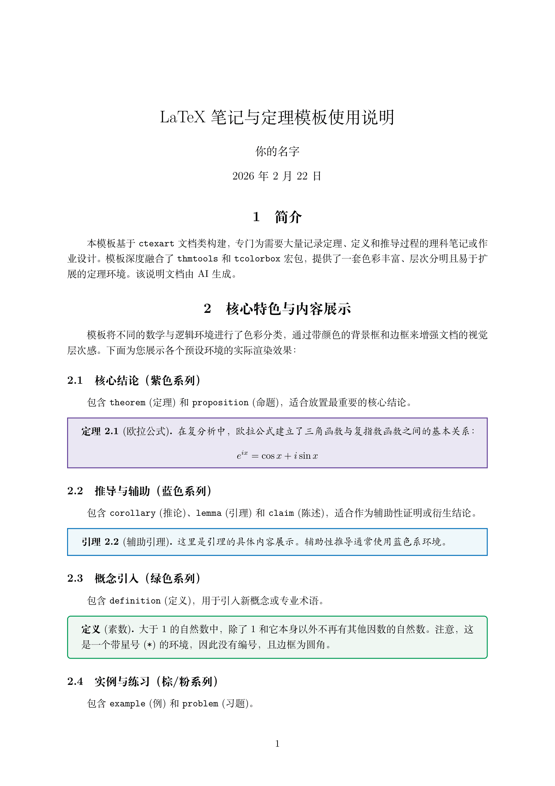
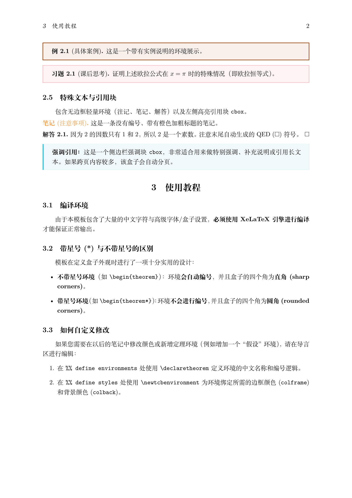

# Colorful LaTeX Notes Template 🎨

这是一个基于 `ctexart` 文档类构建的 LaTeX 笔记与作业模板。模板融合了 `thmtools` 和 `tcolorbox` 宏包，预设了一套色彩丰富、层次分明且易于扩展的定理环境。

适合用于编写理科（数学、物理、计算机等）的结构化学习笔记、课堂总结或课后作业。

## ✨ 核心特性

* **色彩分类：** 通过不同的边框和背景颜色，直观区分**定理/命题**（紫色）、**推论/引理**（蓝色）、**定义**（绿色）、**实例**（棕色）以及**习题**（粉色）。
* **智能边框与编号：**
  * 使用**不带星号**的环境（如 `\begin{theorem}`）：自动编号，并且盒子边框为**直角 (sharp corners)**。
  * 使用**带星号**的环境（如 `\begin{theorem*}`）：不进行编号，并且盒子边框为**圆角 (rounded corners)**。
* **特殊引用块：** 内置左侧高亮引用块（`cbox`）和自带 QED ($\square$) 符号的解答环境（`solution`）。
* **自动分页：** 所有彩色盒子默认开启 `breakable` 属性，跨页长公式和长文本自动完美切分。

## 📸 效果预览

`
`

## 🚀 快速开始

### 编译要求
由于本模板包含了大量的中文字符与高级字体/盒子设置，**必须使用 XeLaTeX 引擎进行编译**。

### 基本用法
直接克隆或下载本仓库，修改 `main.tex` 中的正文内容即可。

```latex
% 插入一个带编号和标题的定理（直角边框）
\begin{theorem}[欧拉公式]
在复分析中，欧拉公式建立了三角函数与复指数函数之间的基本关系：
$$e^{ix} = \cos x + i\sin x$$
\end{theorem}

% 插入一个不带编号的定义（圆角边框）
\begin{definition*}[素数]
大于1的自然数中，除了1和它本身以外不再有其他因数的自然数。
\end{definition*}

% 插入解答环境
\begin{solution}
这里是解答过程，末尾会自动添加一个方块符号。
\end{solution}
